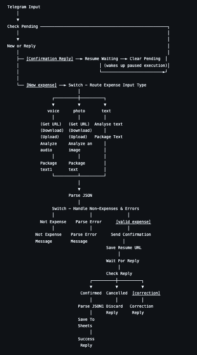
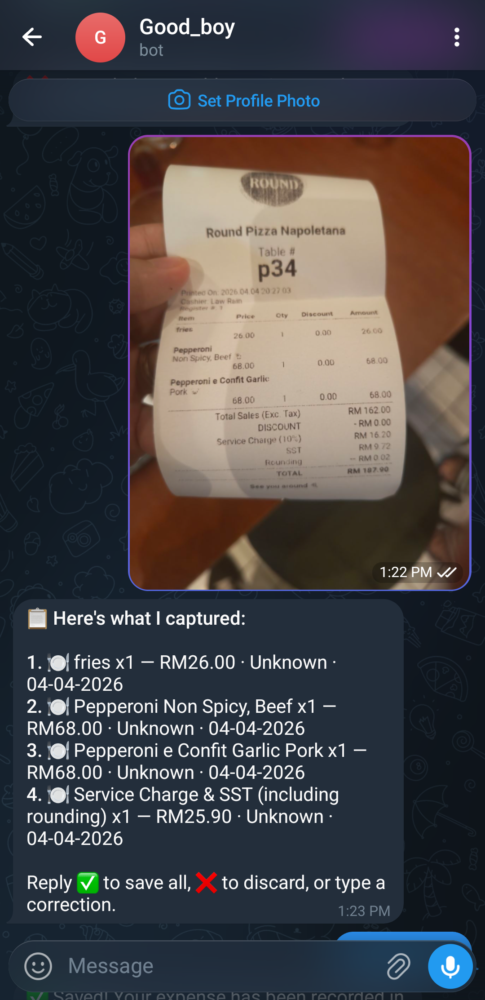

# 🤖 Telegram Expense Tracker Bot

An AI-powered Telegram bot that logs your daily expenses to Google Sheets using **n8n**, **Gemini AI**, and the **Telegram Bot API**.

## Features
- Accepts **text, voice, and photo** (receipt) inputs via Telegram
- Uses Gemini AI to extract: category, item, quantity, price, payment method, and date
- Supports **multiple expenses in one message**
- Sends a **confirmation message** before saving
- Appends structured rows to Google Sheets automatically

## Tech Stack
- [n8n](https://n8n.io) — workflow automation (self-hosted on Pikapods)
- [Gemini AI](https://ai.google.dev) — text parsing, audio transcription, receipt OCR
- [Telegram Bot API](https://core.telegram.org/bots/api) — messaging interface
- [Google Sheets API](https://developers.google.com/sheets) — data storage

## How It Works

1. You send an expense message to your Telegram bot (text, voice, or photo)
2. Gemini extracts structured data from your message
3. The bot replies with a confirmation summary
4. You reply ✅ to save or ❌ to discard
5. The expense is appended as a row in Google Sheets

## Workflow Overview

## Input Example

### Image input - receipt

## Setup

### Prerequisites
- n8n instance (self-hosted or cloud)
- Gemini API key (free at [Google AI Studio](https://aistudio.google.com))
- Telegram Bot Token (from [@BotFather](https://t.me/botfather))
- Google Sheets OAuth2 credentials

### Installation

1. From the workflows folder, import `goodboi-expense-tracker-tg-sanitised.json` into your n8n instance.

2. Create a Google Sheet with two tabs:
   - **Expenses** — columns: `Date`, `Category`, `Item`, `Quantity`, `Total Price`, `Payment Method`, `Raw Input`
   - **Pending** — columns: `chat_id`, `resume_url`, `timestamp`

3. Add your credentials to n8n: Telegram Bot, Google Gemini API, Google Sheets OAuth2.

4. Wire up the environment variables (see below), then publish the workflow.

5. Send your bot a message to test.

### Environment variables

The workflow uses `{{ $env.X }}` in place of all secrets and IDs. n8n only resolves these in fields that accept expressions — everything else needs a manual pass.

**Resolved at runtime** (just set the env var on your n8n instance):

- `TELEGRAM_BOT_TOKEN` — embedded in Telegram API URLs
- `GEMINI_API_KEY` — sent as the `x-goog-api-key` header to Gemini

**Not evaluated by n8n** — these fields are treated as literal identifiers:

- `credentials.id` on every credentialed node
- `webhookId` on Telegram and Wait nodes
- Resource-locator `value` fields (Google Sheets `documentId` and `sheetName`)

Pick one of:

- **Option A — Fix in the UI after import.** Open each node and reselect the credential, sheet, and tab from the dropdowns. Placeholders make it obvious what's missing.
- **Option B — Template before import.** Run `envsubst` (or similar) over the JSON to render real values in, then import. Cleaner for repeatable deploys.

**Full list:**

| Purpose | Variables |
|---|---|
| Secrets | `TELEGRAM_BOT_TOKEN`, `GEMINI_API_KEY` |
| Google Sheets | `GOOGLE_SHEET_ID`, `GOOGLE_SHEET_GID_PENDING`, `GOOGLE_SHEET_GID_EXPENSES` |
| Credential IDs | `TELEGRAM_CREDENTIALS_ID`, `GEMINI_CREDENTIALS_ID`, `GOOGLE_SHEETS_CREDENTIALS_ID` |
| Webhook IDs | `TELEGRAM_INPUT_WEBHOOK_ID`, `SEND_CONFIRMATION_WEBHOOK_ID`, `WAIT_FOR_REPLY_WEBHOOK_ID`, `SUCCESS_REPLY_WEBHOOK_ID`, `DISCARD_REPLY_WEBHOOK_ID` (reused by Correction Reply), `NOT_EXPENSE_WEBHOOK_ID`, `PARSE_ERROR_WEBHOOK_ID` |

## License
MIT
